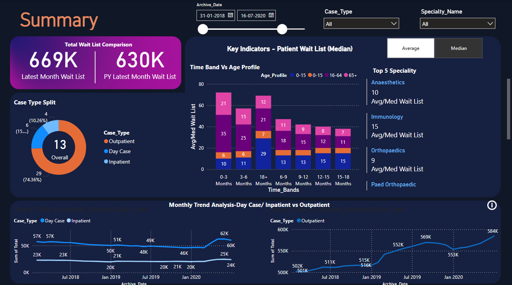

# 🏥 Patient Waitlist Analytics Dashboard

This project delivers a comprehensive analysis of patient waiting lists using Power BI. It explores wait time trends, patient types, and specialty groups, providing interactive insights across various dimensions such as age profiles, case types, and time bands.

---

## 🎯 Objectives

- Analyze patient waitlist data across case types and specialties
- Track waitlist trends over time using dynamic visuals
- Highlight key performance indicators (KPIs) with custom cards
- Build an interactive multi-page Power BI dashboard for healthcare insights

---

## 🔍 Project Highlights

- Cleaned and transformed healthcare data using Power BI and Power Query
- Built a 3-page interactive dashboard featuring:
  - 📊 KPI cards for latest and previous month waitlist totals
  - 📈 Line chart showing patient trends by case type over time
  - 🍩 Donut chart visualizing case type distribution
  - 🧠 Tooltip with embedded bar chart for specialty breakdown
  - 📋 Drillable grid view with patient details grouped by date, age, and time bands
- Designed using a consistent color palette and dark-themed layout

---

## 🛠️ Tech Stack

| Tool              | Purpose                                      |
|-------------------|----------------------------------------------|
| Power BI Desktop  | Data modeling, dashboard design              |
| Power Query       | Data transformation and merging              |
| DAX               | Calculated columns, dynamic KPI logic        |

---

## 📸 Dashboard Previews

### 📄 Summary Dashboard – Page 1  

### 🗂️ Detailed Grid View – Page 2  

### 📊 Specialty Chart  

### 🧠 Tooltip Popup  

---

## 📌 How to Use

1. Clone or download this repository.
2. Open `PatientWaitingList.pbix` using Power BI Desktop.
3. Use the slicers to filter data by:
   - Case Type
   - Specialty Name
   - Age Profile
   - Archive Date
4. Hover over chart visuals to view the dynamic tooltips.
5. Navigate through the report using the bottom page tabs.

---

## 📚 Data Source & Reference

This dashboard was inspired by and built using the data and guidance provided in the following tutorial:

🎥 YouTube Tutorial: [Patient Waiting List Dashboard in Power BI](https://youtu.be/G8ikAJele_s?si=ypFT0UiBbgO4eK6P)  
📊 Dataset: Provided by the tutorial author via the video description

> Full credit to the original creator for the dataset and concept. This version is customized for personal learning and portfolio use.

---

## 🧠 Insights Gained

- Outpatient cases dominate the waitlist (approx. 74%)
- Top specialties with highest wait times include ENT and Bones
- Notable spikes in waitlist counts observed around 2020
- Tooltip charts provide fast specialty-level drilldowns without changing pages

---

